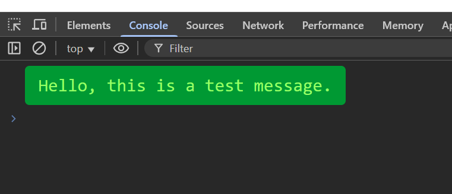
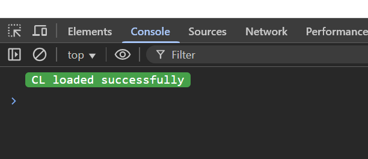

# Custom Console Logger (CL)



## What is this project?

This project is a lightweight JavaScript library called **CL (Custom Logger)** that allows you to log custom-styled messages to the browser console. It extends the basic `console.log` functionality by letting you easily add colors, border radius, font size, and padding to your log messages, making debugging and error reporting more visually clear and professional.

## Why did I build it?

While working on various JavaScript projects, I found the default `console.log` output to be visually bland and sometimes hard to distinguish between different types of messages. I wanted a quick and reusable way to highlight important logs, errors, or statuses directly in the console, without having to write repetitive CSS each time. This library solves that problem by providing a single, easy-to-use function for custom console output.

## Technologies and Tools Used

- **JavaScript**: The entire library is written in vanilla JavaScript, making it lightweight and dependency-free.
- **Browser Console API**: Utilizes the `%c` formatting feature of `console.log` for custom styles.

## How does it work?

The main function is `cl.log`, which takes the following parameters:

```js
cl.log(message, backgroundColor, fontColor, borderRadius, fontSize, padding);
```

You can use color names or hex codes for colors, and specify CSS values for the other parameters. If you omit a parameter, a default value is used.

### Example Usage

```js
cl.log('CL loaded successfully', '#46a049', '#ffffff', '4px', '14px', '0 7px');
```

This will output a styled message in the console:




### Core Implementation

Here’s a look at the main logic from the project:

```js
let cl = {
   log: function(msg, bgColor, fontColor, borderRadius, fontSize, padding) {
      msg = msg ? msg : 'Default message';
      bgColor = bgColor ? bgColor : '#ffffff';
      fontColor = fontColor ? fontColor : '#000000';
      borderRadius = borderRadius ? borderRadius : '0';
      fontSize = fontSize ? fontSize : '10';
      padding = padding ? padding : '0';

      var colors = [bgColor, fontColor];

      for(let i = 0; i < colors.length; i++) {
         if(colors[i].charAt(0) == '#') {
            if(!this.checkColorHex(colors[i])) {
               return false;
            }
         } else if(colors[i].charAt(0) != '#') {
            if(!this.checkColorName(colors[i])) {
               return false;
            }
         }
      }

      let styles = [
         'background: ' + bgColor,
         'color: ' + fontColor,
         'border-radius: ' + borderRadius,
         'font-size: ' + fontSize,
         'padding: ' + padding
      ].join(';');

      console.log('%c' + msg, styles);
   },
   // ...existing code...
};
```

The library also includes helper functions to validate color values and display errors if an invalid color is provided:

```js
checkColorHex: function(color) {
   let allowedChars = 'ABCDEFGHIJKLMNOPQRSTUVWXYZabcdefghijklmnopqrstuvwxyz0123456789';
   color = color.substr(1);

   if((color.length < 3) || (color.length == 5) || (color.length > 6)) {
      this.error("The color you entered: \"" + color + "\" is not a valid color.");
      return false;
   }

   for(let i = 0; i < color.length; i++) {
      if(allowedChars.indexOf(color.charAt(i)) == (-1)) {
         this.error("The color you entered: \"" + color + "\" is not a valid color.");
         return false;
      }
   }

   return true;
},

checkColorName: function(color) {
   let s = new Option().style;
   s.color = color;
   if(s.color == color) {
      return true;
   } else {
      this.error("The color you entered: \"" + color + "\" is not a valid color");
      return false;
   }
},

error: function(msg) {
   console.error(msg);
}
```

## What have I learned?

*Note: I built this library years ago. If I were to design it today, I would use a single options object as an argument (e.g., `{ color: 'red', background: 'orange' }`) to make it much clearer what each value represents and to improve code readability and maintainability.*

Building this project helped me deepen my understanding of the browser console API, JavaScript object design, and user-friendly API creation. I also learned the importance of validating user input and providing clear error messages for better developer experience.

If you’d like to know more about the project, feel free to reach out!
